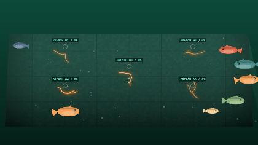
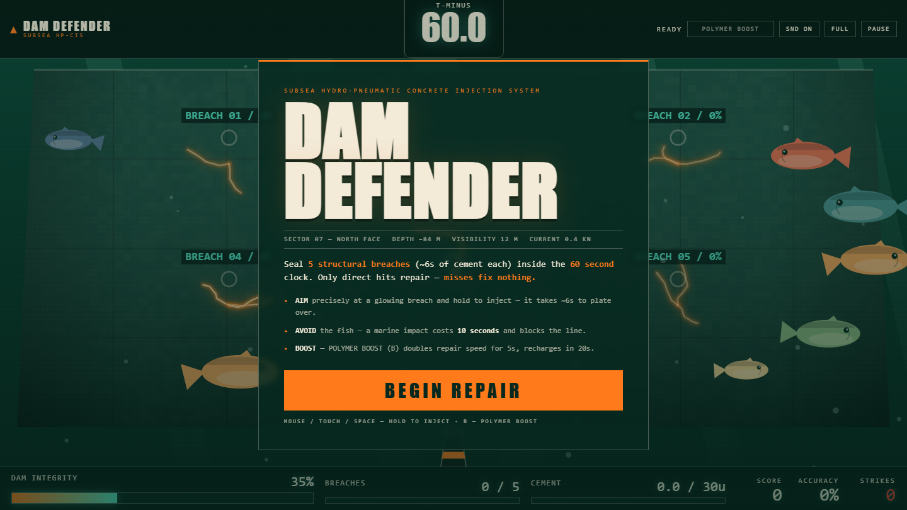
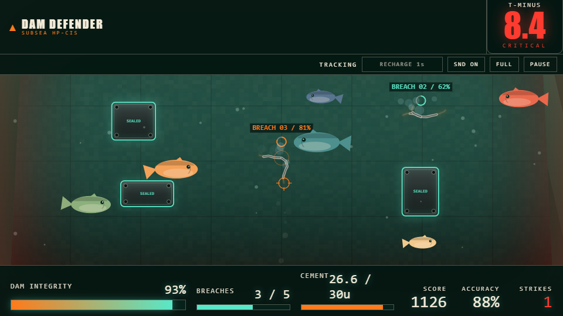
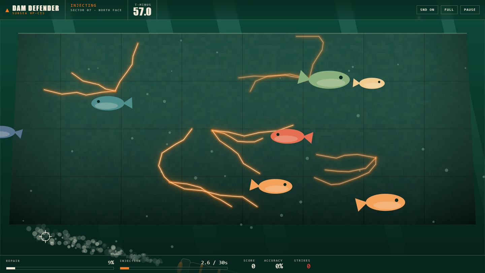
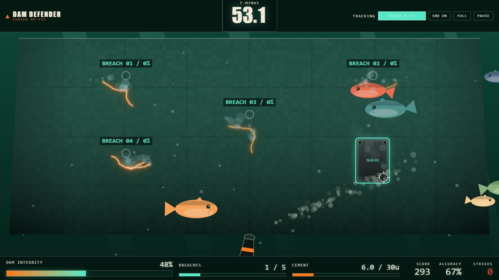
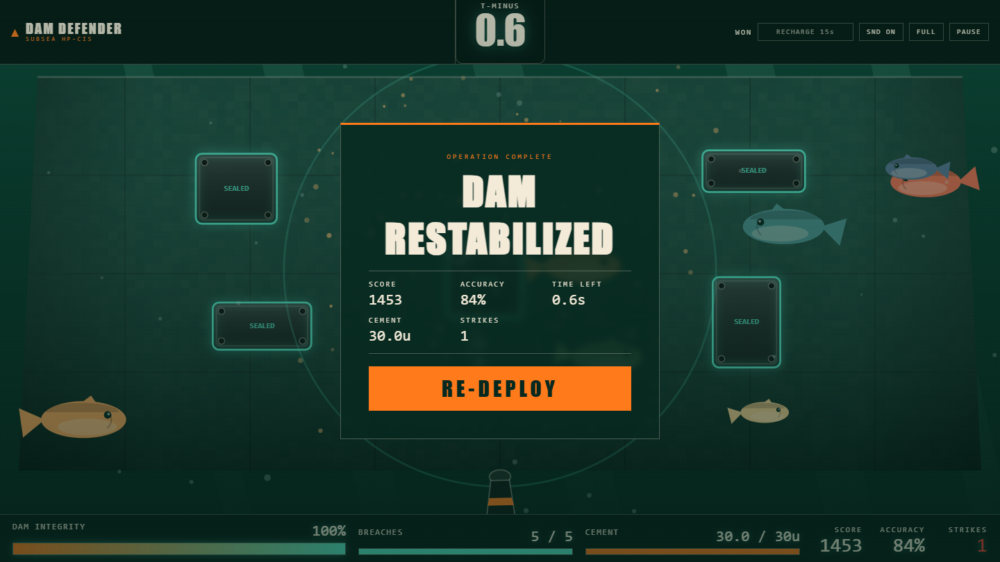
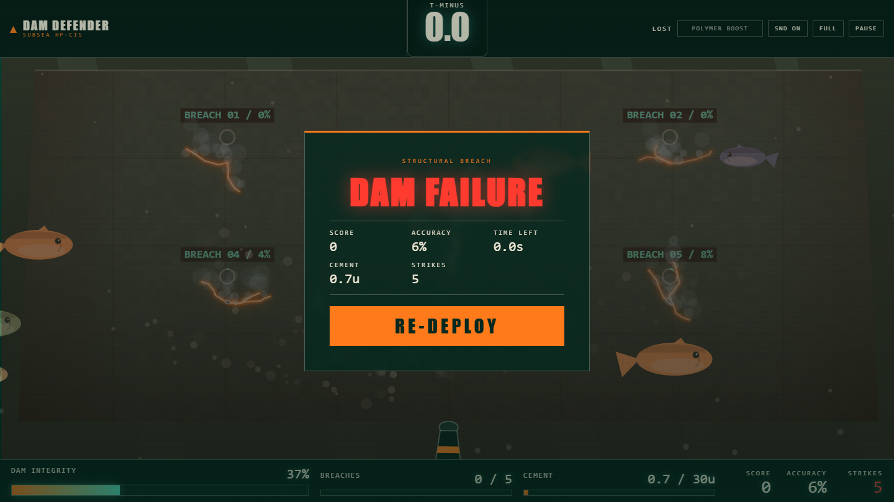
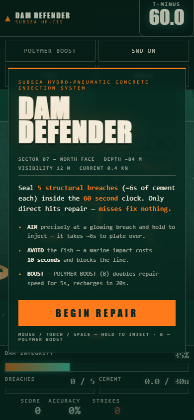
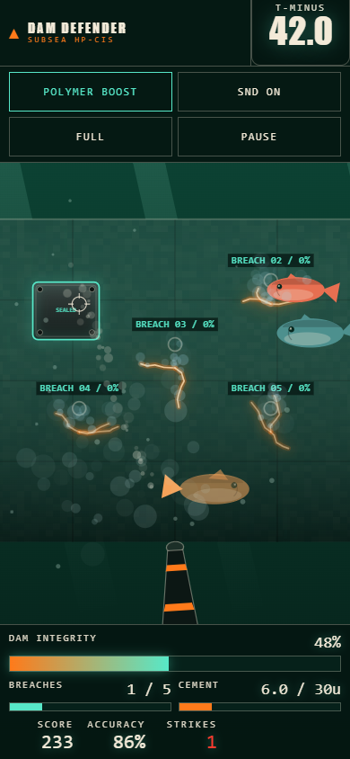

# DAM DEFENDER

### *The dam is leaking. The fish are unionized. You have a cement gun and 60 seconds.*


-ff4d2e)


A self-contained browser arcade game about underwater structural engineering —
which is a real job, we checked. Vanilla JS + Canvas. No installs, no build
step, no mercy.

**A spiritual successor to the civil engineering department of
[Athiradi (2026)](https://en.wikipedia.org/wiki/Athiradi_(2026_film))** — the
movie that asked "what if a civil engineering student's greatest weapon was
cement?" and accidentally invented this game.



<details>
<summary><b>🎬 Full gameplay video (40s, with sound-free existential dread)</b></summary>
<br>
<video src="docs/media/gameplay.webm" controls width="800"></video>

[Direct link if the embed doesn't load](docs/media/gameplay.webm)
</details>

---

## 🚰 The Situation

Sector 07, North Face, 84 meters down. The dam has sprung **5 structural
breaches** and the countdown to catastrophic failure is **60 seconds**. You are
the operator of the Subsea Hydro-Pneumatic Concrete Injection System — a cement
gun mounted on the seafloor, aimed by a very nervous person (you).

There is one complication. The local fish have decided that your repair beam
is, scientifically speaking, a great place to be. Every fish that crosses your
firing line costs you **10 seconds** you absolutely do not have.

## � The Lore: Athiradi Mode

For the uninitiated: **[Athiradi](https://en.wikipedia.org/wiki/Athiradi_(2026_film))**
is the 2026 Malayalam masala masterpiece where **Samkutty "Sam Boy" Oommen**
(Basil Joseph), a civil engineering student at BCET, spends four years and one
emotional breakdown trying to revive a banned college fest — while **Thotta
Kuttan** (Tovino Thomas), a retired goon and aspiring playback singer, dedicates
his life to ruining it.

This game is the exam Sam Boy never got to sit for.

| DAM DEFENDER | Athiradi equivalent |
|--------------|---------------------|
| You, the operator | **Samkutty** — final-year energy, doomed project, refuses to quit |
| The Cement Thrower | The degree Sam Boy actually earned. BCET's finest export. |
| The fish | **Thotta Kuttan's gang** — show up uninvited, block your path, weirdly serene about it |
| MARINE IMPACT −10s | An *athiradi*. The title literally translates to "strike." We don't make the rules. Actually we did. |
| The 60s clock | The college committee deciding whether your fest gets approved |
| POLYMER BOOST | A **Vineeth Sreenivasan cameo** — arrives suddenly, makes everything dramatically better for 5 seconds |
| Sealed breach | One step closer to conducting Aarohan. The fest lives. |
| DAM FAILURE | Fest banned again. Joppan is disappointed in you. |
| Your score | Stolen credit. Vivi did this. |

The Cement Thrower is the ultimate masala weapon — an improvised instrument of
structural chaos that launches wet concrete at physics' face. In the movie's
universe it levels a college campus. Here, it saves a dam. Same energy, better
ethics.

## �🎮 Play It

```bash
node server.js        # then open http://127.0.0.1:3000
```

Or just open `index.html` in a browser. It literally cannot get easier.

## 📜 The Rules (read these, the dam won't)

| Rule | Consequence |
|------|-------------|
| Seal **5 breaches**, ~6s of aimed cement each (**30u total**) | The dam lives |
| Beat the **60 second** clock | The valley lives |
| Fire at empty wall | Nothing repairs. The cement judges you |
| Fish crosses your firing line | **MARINE IMPACT −10s** + a strike (athiradi) |
| Shoot an already-sealed patch | Nothing. It's done. Let it go |
| Hit **POLYMER BOOST** (`B`) | 2× repair speed for 5s (20s recharge) |

**Accuracy** = on-breach time ÷ total trigger time. Missing is expensive —
morally *and* statistically.

## 🕹️ Controls

| Input | Action |
|-------|--------|
| `MOUSE` / `TOUCH` / `SPACE` | Aim + hold to inject cement |
| `B` | Polymer boost |
| HUD buttons | Pause · Mute · Fullscreen |

## 🐟 Know Your Enemy

The fish are not smart. They are *numerous*, they are *serene*, and they do not
care about your deadlines. They drift across the dam face at exactly the height
of your firing line, because of course they do — like temple-festival organisers
who found out a car stunt show just blocked the circumambulation route. The
engine predicts their wrap-around paths — watch the line, lift off the trigger
when one waddles through, and save your profanity for the -10s flash.

They cannot be reasoned with. They cannot be negotiated with. They are,
however, excellent singers.

<details>
<summary><b>📸 Screenshot gallery — moments of triumph and damp</b></summary>
<br>

| Briefing | On the job |
|----------|-----------|
|  |  |

| Cement injection | Sealed patch |
|------------------|--------------|
|  |  |

| Victory | Defeat |
|---------|--------|
|  |  |

| Mobile briefing | Mobile repairs |
|-----------------|----------------|
|  |  |

</details>

<details>
<summary><b>🔧 How it works (for the engineers in the back)</b></summary>
<br>

| File | Role |
|------|------|
| `game-core.js` | Pure deterministic engine — 5-crack repair model, boost, fish/strikes, layout. Runs in Node, fully unit-testable. |
| `game-audio.js` | `window.DamAudio` — procedural WebAudio synth score + SFX, with override slots for licensed tracks. |
| `game.js` | Canvas renderer, input smoothing, particles, HUD wiring. |
| `index.html` / `styles.css` | Layout + editorial-industrial HUD and overlays. |
| `server.js` | Loopback static server. No dependencies, obviously. |
| `tests/run-tests.js` | Engine unit tests. |
| `tests/browser-test.js` | Playwright-core acceptance test (needs local Chrome). Drives the game with a fish-prediction autopilot — the same one that recorded the video above. |
| `tools/record-gameplay.js` | Records real gameplay to `.webm` + dumps preview frames. |
| `tools/make-apng.js` | Turns those frames into the animated preview PNG. Dependency-free. |

</details>

<details>
<summary><b>🎵 Soundtrack & swapping in your own tracks</b></summary>
<br>

All music/SFX is procedurally synthesized via WebAudio — three original synth
scores (`playing`, `won`, `lost`) plus silence when paused. `assets/bg.mp3` is
wired into the `playing` slot in `index.html`.

The audio slots were born with Athiradi on the mind: **"Athiradi Khol De"**
while you play, **"Ammaputhappe"** when you win, and **"Avarohanam"** when you
lose — avarohanam, the descent. Like the fest. Like your GPA. Like the water
level when the dam gives up.

To use your own licensed tracks, map the slots in a `<script>` that runs
**before** `game-audio.js`/`game.js`:

```html
<script>
window.DAM_AUDIO_TRACKS = {
  playing: 'audio/athiradi-khol-de.ogg',
  won:     'audio/ammaputhappe.ogg',
  lost:    'audio/avarohanam.ogg'
};
</script>
```

Missing files or rejected playback automatically fall back to the built-in
synth score for that mode.

</details>

## ❓ FAQ

**Q: Is this game based on Athiradi?**
A: Spiritually? Yes. Legally? This is a civil engineering simulator and any
resemblance to BCET's civil department is entirely deserved.

**Q: Why is the penalty called a strike?**
A: Because athiradi. That's the whole bit. Next question.

**Q: Can I shoot the fish?**
A: No. This is a civil engineering simulator, not a fishing simulator. The fish
are protected — possibly by a retired goon with a recording contract.

**Q: I sealed all 5 breaches with 0.6 seconds left. Is that good?**
A: That's the intended experience. Aarohan is conducted. Your cardiologist
disagrees.

**Q: Why does missing cost me accuracy but not cement?**
A: The cement is infinite. Your dignity is not.

**Q: The autopilot in the recording got 88% accuracy and still nearly lost.**
A: Correct. Even a Sam Boy with aim assist nearly failed the course. The dam
does not grade on a curve.

**Q: What did it cost to make this game?**
A: Everything. The fish took the rest.

---

*Built with concrete, canvas, and a healthy fear of water.*
*Athiradi khol de — but please, aim carefully.*
